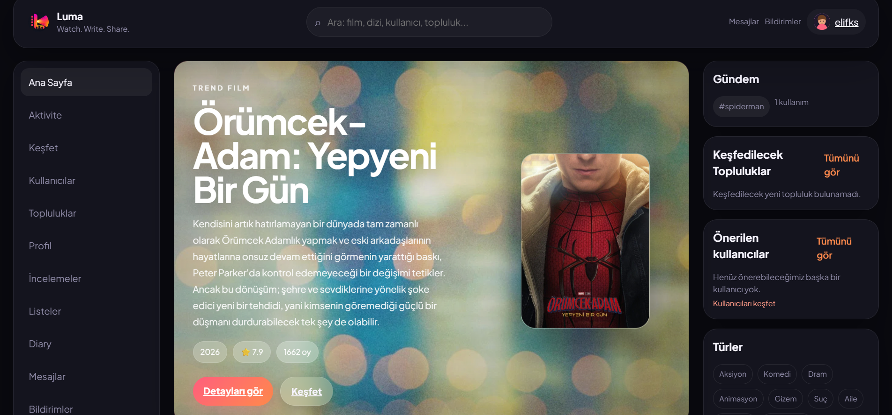
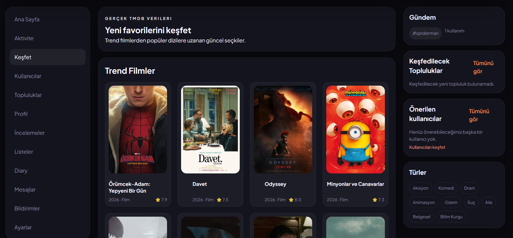
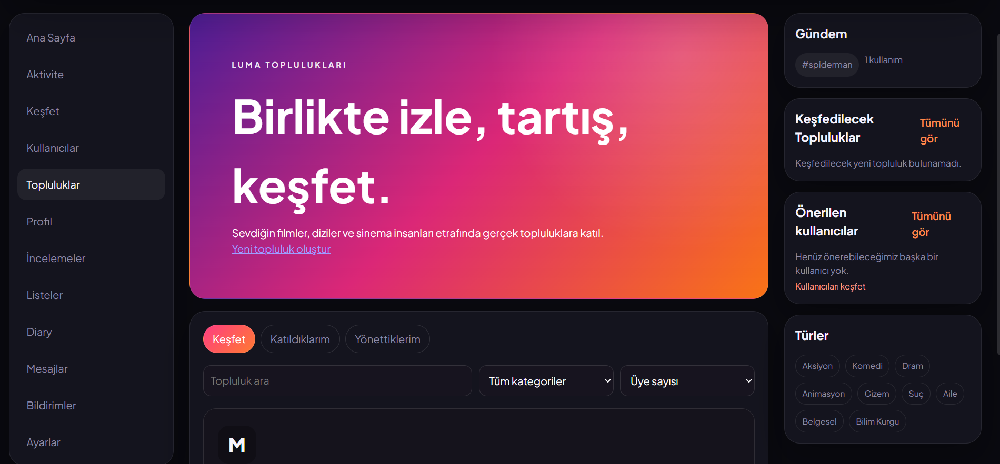
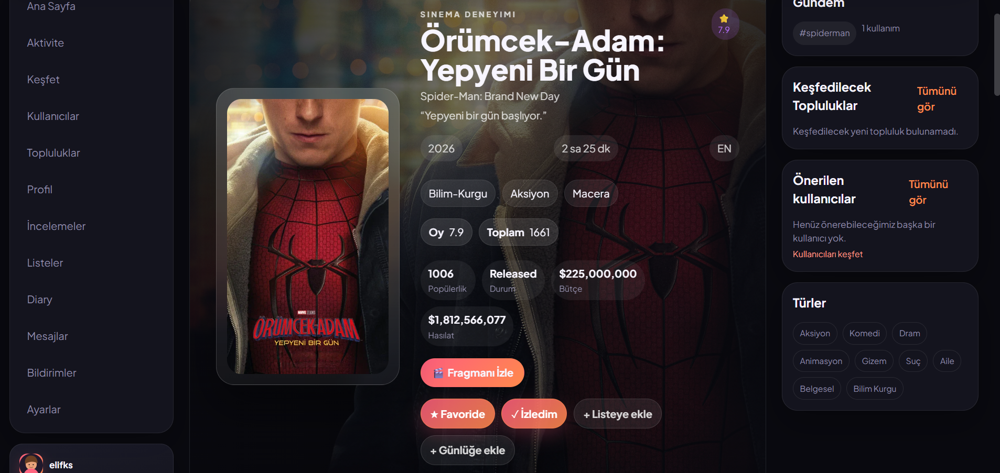
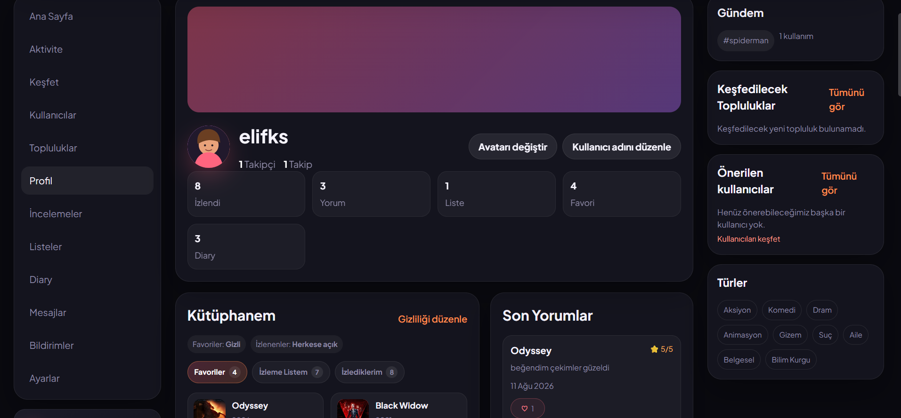

# Luma

Luma; film ve dizileri keşfetmeyi, izleme geçmişini kaydetmeyi, inceleme ve listeler oluşturmayı ve diğer sinemaseverlerle etkileşim kurmayı sağlayan sosyal bir film-dizi platformudur.

- **Canlı uygulama:** [https://luma-d88c7.web.app](https://luma-d88c7.web.app)
- **GitHub deposu:** [https://github.com/elif-ks/Luma](https://github.com/elif-ks/Luma)

## Proje Hakkında

Luma, TMDB üzerinden film ve dizi keşfini kişisel bir izleme arşiviyle birleştirir. Kullanıcılar yapımları favorilerine veya izleme listelerine ekleyebilir, izlediklerini kaydedebilir ve ayrıntılı Diary kayıtları oluşturabilir.

Uygulamanın sosyal tarafında incelemeler, özel listeler, gönderiler, topluluklar, aktivite akışı, takip sistemi, bildirimler ve birebir mesajlaşma bulunur. Böylece keşif, kişisel arşiv ve sinemaseverler arasındaki etkileşim aynı arayüzde sunulur.

## Ekran Görüntüleri

### Ana Sayfa



### Keşfet



### Topluluklar



### Film Detay Sayfası



### Profil



## Özellikler

### Keşif

- TMDB üzerinden film ve dizi keşfi
- Film, dizi, kişi, kullanıcı ve topluluk araması
- Film ve dizi detay sayfaları
- Oyuncu, ekip, tür, puan, özet, fragman, benzer yapımlar ve öneriler
- Kullanıcı arşivine dayalı, gerekçeleri gösterilen kişiselleştirilmiş öneriler

### Kişisel Arşiv

- Favoriler, izlenenler ve izleme listesi
- Film ve dizi destekli Diary kayıtları
- İzleme tarihi, puan, kısa not ve yeniden izleme bilgisi
- Diary takvim görünümü, filtreler ve istatistikler
- Favoriler ve izlenenler için profil görünürlüğü ayarları

### İncelemeler ve Listeler

- 1–5 puan ve spoiler desteği bulunan incelemeler
- İnceleme düzenleme, silme ve beğenme
- Herkese açık ve gizli listeler
- Listeye film veya dizi ekleme ve listeden çıkarma
- Sahip, editör ve görüntüleyici rolleriyle ortak listeler
- Liste görünürlüğü, ortak yönetimi ve liste beğenileri

### Sosyal Özellikler

- Kullanıcı takip sistemi ve herkese açık kullanıcı profilleri
- Metin veya yapım bağlantısı içerebilen sosyal gönderiler
- Gönderi beğenileri, spoiler destekli yanıtlar, yeniden paylaşım ve kaydetme
- Üyelik, gönderi, yanıt ve anket özellikleri bulunan topluluklar
- Gerçek zamanlı birebir mesajlaşma
- Site içi bildirimler
- Kullanıcı engelleme ve sessize alma
- Kullanıcı, gönderi, inceleme, liste ve topluluk içeriklerini şikâyet etme

### Aktivite Akışı

- İnceleme paylaşımı aktiviteleri
- Herkese açık liste oluşturma aktiviteleri
- Kullanıcının açıkça izin verdiği Diary izleme aktiviteleri
- Varsayılan olarak kapalı Diary aktivite paylaşımı
- Takip edilen kullanıcıların aktivitelerini ve kullanıcının kendi aktivitelerini ayrı görme
- Sosyal gönderilerden ayrı tutulan aktivite içerik türü

### Hesap ve Profil

- E-posta ve parola ile kayıt ve giriş
- E-posta doğrulama ve şifre sıfırlama
- Firestore rezervasyonuyla benzersiz kullanıcı adı
- Kullanıcı adı değiştirme
- Hazır profil avatarları ve biyografi
- Herkese açık profil sayfaları

## Kullanılan Teknolojiler

| Teknoloji | Kullanım alanı |
| --- | --- |
| Preact | Kullanıcı arayüzü ve bileşen yapısı |
| React uyumluluk katmanı | React API uyumluluğu için `@preact/compat` |
| Vite | Geliştirme sunucusu ve production build |
| React Router | İstemci tarafı rotalar ve navigasyon |
| Firebase Authentication | E-posta/parola oturumları ve e-posta doğrulama |
| Cloud Firestore | Profiller, arşiv, incelemeler, listeler ve sosyal veriler |
| Firebase Hosting | Production uygulamasının barındırılması |
| Firebase App Check | reCAPTCHA Enterprise tabanlı istemci entegrasyonu |
| TMDB API | Film, dizi, kişi ve yapım metadata verileri |
| CSS | Özel tasarım sistemi, responsive yerleşim ve bileşen stilleri |
| GitHub Actions | Firestore Rules testleri ve uygulama build doğrulaması |

## Kurulum

Gereksinimler:

- Node.js ve npm
- Firestore Rules testlerini yerelde çalıştırmak için Java 21

Projeyi klonlayıp bağımlılıkları kurun:

```bash
git clone https://github.com/elif-ks/Luma.git
cd Luma
npm install
```

`.env.example` dosyasını `.env` adıyla kopyalayın ve kendi TMDB ile Firebase yapılandırma değerlerinizi ekleyin. Gerçek anahtarları repoya göndermeyin.

Geliştirme sunucusunu başlatın:

```bash
npm run dev
```

## Ortam Değişkenleri

| Değişken | Açıklama | Zorunlu |
| --- | --- | --- |
| `VITE_FIREBASE_API_KEY` | Firebase Console'daki web uygulaması API anahtarı | Evet |
| `VITE_FIREBASE_AUTH_DOMAIN` | Firebase Authentication alan adı | Evet |
| `VITE_FIREBASE_PROJECT_ID` | Firebase proje kimliği | Evet |
| `VITE_FIREBASE_STORAGE_BUCKET` | Firebase web uygulaması yapılandırmasındaki Storage bucket değeri | Evet |
| `VITE_FIREBASE_MESSAGING_SENDER_ID` | Firebase mesajlaşma gönderen kimliği | Evet |
| `VITE_FIREBASE_APP_ID` | Firebase web uygulaması kimliği | Evet |
| `VITE_FIREBASE_APPCHECK_SITE_KEY` | reCAPTCHA Enterprise yapılandırmasından alınan App Check site anahtarı; yalnızca production ortamında kullanılır | Hayır |
| `VITE_TMDB_ACCESS_TOKEN` | TMDB hesabından alınan API erişim belirteci | Evet |

## Firebase Kurulumu

Projede Firebase Authentication, Cloud Firestore, Firebase Hosting ve Firebase App Check entegrasyonları bulunur. App Check istemci entegrasyonu production ortamında ve `VITE_FIREBASE_APPCHECK_SITE_KEY` tanımlandığında başlatılır; bu ifade Firebase Console'da enforcement ayarının açık olduğu anlamına gelmez.

Geliştiricilerin proje sahibine ait üretim Firebase projesini kullanması gerekmez. Kendi Firebase projenizi kullanacaksanız:

1. Firebase Console'da bir web uygulaması oluşturun.
2. Authentication içinde e-posta/parola sağlayıcısını yapılandırın.
3. Cloud Firestore'u oluşturun ve proje kökündeki güvenlik kuralları ile indeksleri kendi projenize yayınlayın.
4. `.env` değerlerini kendi Firebase web uygulamanıza göre ayarlayın.
5. Firebase CLI proje bağlantısını ve Hosting hedefini kendi projenize göre yapılandırın.
6. App Check kullanacaksanız reCAPTCHA Enterprise sağlayıcısını kendi Firebase uygulamanız için kaydedin.

## Kullanılabilir Komutlar

| Komut | Açıklama |
| --- | --- |
| `npm run dev` | Vite geliştirme sunucusunu başlatır. |
| `npm run build` | Production dosyalarını `dist` klasöründe oluşturur. |
| `npm run preview` | Oluşturulan production build'i yerel olarak önizler. |
| `npm run test:rules` | `demo-luma-rules` proje kimliğiyle Firestore Emulator üzerinde Rules testlerini çalıştırır. |
| `npm run deploy:hosting` | Önce production build alır, ardından yalnızca Firebase Hosting dağıtımını çalıştırır. |

`test:rules` komutu Firestore Emulator için Java gerektirir. `deploy:hosting` komutunu kullanmadan önce Firebase CLI oturumunun ve proje bağlantısının doğru yapılandırıldığından emin olun.

## Proje Yapısı

```text
public/                 Statik logo, favicon ve avatar dosyaları
src/
├── components/         Arayüz ve özellik bileşenleri
├── config/             Uygulama yapılandırmaları
├── context/            Auth, güvenlik ve bildirim context'leri
├── data/               Arayüzde kullanılan yerel yardımcı veriler
├── design-system/      Tasarım token'ları ve ortak bileşenler
├── hooks/              Özel hook'lar
├── pages/              Rotalara bağlı sayfalar
├── services/           Firebase, Firestore ve TMDB servisleri
└── utils/              Ortak yardımcı fonksiyonlar
tests/                  Firestore Rules testleri
firestore.rules         Firestore güvenlik kuralları
firestore.indexes.json  Firestore indeks tanımları
firebase.json           Emulator ve Hosting yapılandırması
```

## Güvenlik ve Gizlilik

- `.env` içindeki ortam değerleri ve diğer gizli bilgiler repoya eklenmemelidir.
- Firestore erişimi `firestore.rules` içindeki kimlik, sahiplik, alan ve görünürlük kontrolleriyle sınırlandırılır.
- Kullanıcı e-postaları Firestore profil belgelerine kopyalanmaz ve herkese açık profillerde gösterilmez.
- Gizli listeler herkese açık liste ve aktivite akışlarında gösterilmez.
- Diary aktiviteleri yalnızca kullanıcı paylaşımı açıkça seçtiğinde oluşturulur; paylaşım varsayılan olarak kapalıdır.
- App Check entegrasyonu, Authentication kontrollerinin veya Firestore güvenlik kurallarının yerine geçmez.

## Dağıtım

Production build oluşturmak için:

```bash
npm run build
```

Mevcut Firebase Hosting yapılandırmasıyla yalnızca Hosting dağıtımı yapmak için:

```bash
npm run deploy:hosting
```

Dağıtım komutu Firebase CLI oturumu ve doğru proje bağlantısı gerektirir.

Canlı uygulama: [https://luma-d88c7.web.app](https://luma-d88c7.web.app)

## Proje Durumu

Luma'nın ilk kararlı sürümü tamamlanmıştır. Proje bundan sonra ağırlıklı olarak bakım, hata düzeltme ve güvenlik güncellemeleriyle sürdürülecektir.

## Veri Kaynağı

Film, dizi ve kişi verileri TMDB API üzerinden sağlanır.

Bu proje TMDB API'yi kullanır ancak TMDB tarafından onaylanmış veya sertifikalandırılmış değildir.

## Geliştirici

- Elif Karakuş
- GitHub: [https://github.com/elif-ks](https://github.com/elif-ks)
